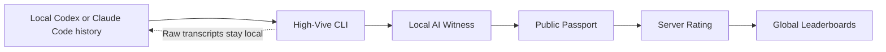

<div align="center">

# HIGH-VIVE

### The Vibe Coding Benchmark Witnessed by the AI That Works With You

[](https://high-vive-league.ngmptdz.chatgpt.site/)


[**Live Leaderboard**](https://high-vive-league.ngmptdz.chatgpt.site/) · [Benchmark Method](docs/BENCHMARK_METHOD.md) · [Privacy](docs/PRIVACY.md) · [v1.0 Work Spec](docs/HIGH_VIVE_V1_WORK_SPEC.md)

</div>

---

> Résumés are written by people. **A High-Vive Passport is written by the AI that actually works with you.**

High-Vive evaluates the AI-collaboration patterns found across your local Codex or Claude Code history and turns them into a comparable **Passport, OVR, HV Rating, and Provisional Tier**.

It measures how you normally define problems, delegate work, verify output, iterate, and ship results—not how polished one hand-picked demo looks.

## Join the League

1. Open [High-Vive](https://high-vive-league.ngmptdz.chatgpt.site/) and choose **Create my Passport**.
2. Sign in and create your public Handle and leaderboard nickname.
3. Choose Codex or Claude Code and start the local assessment.
4. Your Passport is published automatically when the assessment completes.

Large histories can take up to ten minutes. Keep the progress window open until completion appears.

## How High-Vive Works

|  | Principle | What it means |
|---:|---|---|
| **01** | **AUTOMATED LOCAL SCAN** | Your selected AI coding agent's full local history is analyzed automatically in read-only mode. |
| **02** | **YOUR AI KNOWS YOUR VIBE** | The local AI that has worked with you evaluates ten collaboration dimensions and explains strengths, gaps, evidence, and limits. |
| **03** | **SERVER RATING** | The public result becomes a Passport that can be compared with vibe coders worldwide through OVR, HV Rating, Reliability, and Tier. |



## What Makes It Different

| Conventional evaluation | High-Vive |
|---|---|
| People describe themselves. | The AI that works with them evaluates their workflow. |
| A single test session is measured. | Accumulated local work history is assessed. |
| The final code receives most of the attention. | Context, delegation, verification, iteration, and outcomes are measured. |
| A fixed score can ignore the strength of the field. | **HV Rating combines skill, current trust, and relative league position.** |

## Ten AI-Collaboration Metrics

| Metric | What it measures | Weight |
|---|---|---:|
| **Context Packaging** | Turning goals, context, evidence, constraints, and completion criteria into executable direction | 12% |
| **AI Delegation** | Dividing work appropriately between AI execution and human control | 11% |
| **Verification Discipline** | Checking output against tests, primary evidence, and execution results | 14% |
| **Iteration Quality** | Turning intermediate results into precise, quality-improving follow-ups | 10% |
| **Outcome Yield** | Consistently converting AI collaboration into usable outcomes | 14% |
| **Tool Fluency** | Connecting files, terminals, Git, browsers, and data tools | 10% |
| **Domain Clarity** | Defining the work domain, terminology, context, and standards clearly | 8% |
| **Communication Quality** | Communicating intent, priorities, feedback, and handoffs clearly | 7% |
| **Creativity** | Finding novel structures and practical alternatives under constraints | 8% |
| **Token Efficiency** | Producing validated outcomes and meaningful improvement per token | 6% |

## Reading the Ratings

| Rating | Meaning |
|---|---|
| **Raw Score** | Ten evidence-linked scores assigned by the local AI Witness |
| **Calibrated OVR** | A comparable overall skill score calculated with versioned calibration |
| **HV Rating** | The primary 0–1000 league rating: 70% OVR, 15% current Reliability, and 15% relative position among official players |
| **Provisional Tier** | Iron through Challenger, derived from HV Rating |
| **Reliability** | A current trust score for account ownership, assessment lifecycle, evidence scope, challenge, and proofs; it decays by five points every 90 days |
| **Evidence Level** | The verification procedure completed by the assessment |

OVR and Reliability remain visible as separate source values, while HV Rating combines both with a limited cohort-relative component. Ratings are recalculated when a new Passport joins the official league, so standings can move as the field changes.

A successfully published Passport starts a seven-day reassessment cooldown. Failed, expired, or cancelled attempts do not consume it. Reassessments create a new append-only Passport version; older versions remain in profile history while only the latest version competes on leaderboards.

The home page also includes category leaderboards and country standings. Country standings rank nations by the mean HV Rating of their eligible public participants and always show participant counts.

## Privacy by Default

High-Vive follows a simple rule: **raw work stays on your device; only the public result reaches the server.**

- Raw Codex and Claude Code transcripts are not uploaded by default.
- Local files, absolute paths, tool arguments, and command output are not sent.
- Common credential and personal-information patterns are redacted locally.
- The server receives the public Passport, assessment scope, evidence commitment, and verification data.
- Passports are append-only and preserved by version.
- You review the public surface before running the assessment workflow.

Read [PRIVACY.md](docs/PRIVACY.md) and [THREAT_MODEL.md](docs/THREAT_MODEL.md) for the full model.

## Supported Environments

| AI Witness | Windows | macOS | Ubuntu / Linux |
|---|:---:|:---:|:---:|
| **Codex** | ✓ | ✓ | ✓ |
| **Claude Code** | ✓ | ✓ | ✓ |

The web app detects the current operating system and presents the appropriate guided path. A terminal installer is available as a fallback.

<details>
<summary><strong>Start from a terminal</strong></summary>

### Windows PowerShell

```powershell
powershell -NoProfile -ExecutionPolicy Bypass -Command "irm https://raw.githubusercontent.com/jhemj/High_Vive/main/scripts/install-high-vive.ps1 | iex"
```

### macOS or Ubuntu

```bash
curl -fsSL https://raw.githubusercontent.com/jhemj/High_Vive/main/scripts/install-high-vive.sh | bash
```

Available CLI commands:

```text
high-vive login | doctor | prepare | assess | scan | status | preview | submit | logout
```

</details>

## Architecture

- **Web:** React 19, Next.js 16, Vinext
- **Runtime:** Cloudflare Workers
- **Database:** Cloudflare D1 with Drizzle ORM
- **Local assessment:** High-Vive CLI, Codex, Claude Code
- **Protocol:** versioned metrics, calibration, tier bands, schemas, and evidence rules

```text
app/                 Leaderboard, Passport, authentication, and APIs
packages/protocol/   Metrics, categories, scoring, tiers, and schemas
packages/cli/        Local scanner, Witness runner, and uploader
packages/shared/     Validation, authorization, and privacy checks
db/ + drizzle/       D1 schema and deploy-time migrations
tests/               Unit, property, integration, security, and migration tests
docs/                Product, benchmark, privacy, and operations documents
```

## Local Development

Requires Node.js 22.13 or later and pnpm 11.

```bash
git clone https://github.com/jhemj/High_Vive.git
cd High_Vive
pnpm install
pnpm dev
```

Run the complete verification suite:

```bash
pnpm typecheck
pnpm lint
pnpm test
pnpm build
```

## Documentation

- [Product Scope](docs/PRODUCT_SCOPE.md)
- [Benchmark Method](docs/BENCHMARK_METHOD.md)
- [Full-History Assessment](docs/FULL_HISTORY_ASSESSMENT.md)
- [Privacy](docs/PRIVACY.md)
- [Threat Model](docs/THREAT_MODEL.md)
- [Protocol Versioning](docs/PROTOCOL_VERSIONING.md)
- [Operations](docs/OPERATIONS.md)
- [High-Vive v1.0 Work Specification](docs/HIGH_VIVE_V1_WORK_SPEC.md)

## Product Boundary

High-Vive records an AI Witness assessment of local AI coding-agent history found on one device at one point in time. It does not prove identity, an undeleted complete work history, real-world business outcomes, or employment suitability.

Scores are a benchmark of AI-collaboration behavior within a published protocol and a limited evidence scope—not an absolute judgment of a person.

---

<div align="center">

### Your AI knows how you work.

**Build your Passport. Find your tier. Join the global vibe coder leaderboard.**

[**ENTER HIGH-VIVE →**](https://high-vive-league.ngmptdz.chatgpt.site/)

</div>

